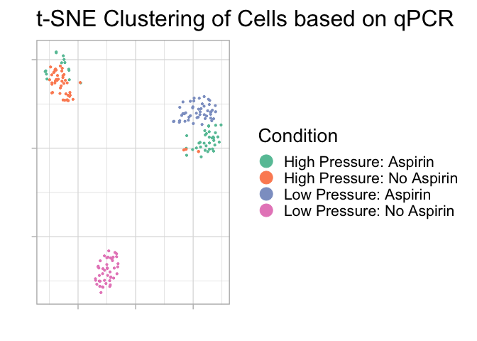
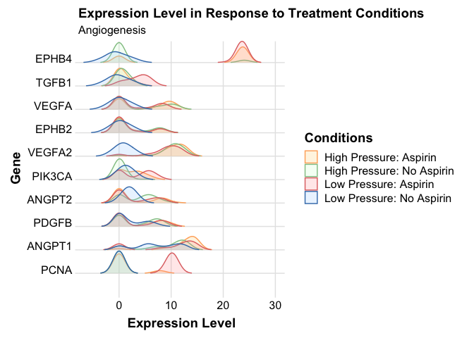

# Background

Batches of 48 endothelial cells were implanted in a flow model and exposed to 4 conditions (192 cells total). 4 conditions were imposed: 

- High pressure with Aspirin
- High pressure with no Aspirin
- Low pressure with Aspirin
- Low pressure with no Aspirin
 
48 genes were chosen based on their biological relevance for analysis with regards to changes in their expression levels to these conditions. These genes participate in immune responses, Interleukin- and -cytokine signaling.

**Load Libs**


```r
# Working dir
setwd("/Users/Kamileh/Code/endo_cell_flow_aspirin_old/scripts")

# load libs
load.libs <- c(
  "readxl",
  "data.table",
  "dplyr",
  "ggplot2",
  "caret",
  "Rtsne",
  "knitr",
  "devtools",
  "ggfortify",
  "reshape2",
  "tidyr",
  "stringr",
  "ggridges",
  "grid")
options(install.packages.check.source = "no")
options(install.packages.compile.from.source = "never")
if (!require("pacman")) install.packages("pacman"); library(pacman)
p_load(load.libs, update = TRUE, character.only = TRUE)
status <- sapply(load.libs,require,character.only = TRUE)
if(all(status)){
  print("SUCCESS: You have successfully installed and loaded all required libraries.")
} else{
  cat("ERROR: One or more libraries failed to install correctly. Check the following list for FALSE cases and try again...\n\n")
  status
}
```

```
## [1] "SUCCESS: You have successfully installed and loaded all required libraries."
```

**Create a variable for Group that is 1-4 identifying each condition (used for unsupervised clustering), factorize the high pressure and aspirin conditions for statistical analysis.**


```r
### DATA HAS ALREADY BEEN LOG TRANSFORMED

flow_experiments <- read_excel("/Users/Kamileh/Code/endo_cell_flow_aspirin_old/previous_analysis/Flow experiments.xlsx", sheet = "Combined")
gene_types <- read_excel("/Users/Kamileh/Code/endo_cell_flow_aspirin_old/previous_analysis/Flow experiments.xlsx", sheet = "Gene_Type", col_names = FALSE)

colnames(gene_types) <- c("gene","pathway")

flow_experiments <- cbind(Group = NA, flow_experiments)
flow_experiments$Group <- ifelse(flow_experiments$Aspirin == 1 & flow_experiments$High_Pressure == 1, 1,
                                 ifelse(flow_experiments$Aspirin == 0 & flow_experiments$High_Pressure == 1, 2,
                                        ifelse(flow_experiments$Aspirin == 1 & flow_experiments$High_Pressure == 0, 3, 4)))

flow_experiments$Group <- as.factor(flow_experiments$Group)

levels(flow_experiments$Group)[levels(flow_experiments$Group)==1] <- "High Pressure: Aspirin"
levels(flow_experiments$Group)[levels(flow_experiments$Group)==2] <- "High Pressure: No Aspirin"
levels(flow_experiments$Group)[levels(flow_experiments$Group)==3] <- "Low Pressure: Aspirin"
levels(flow_experiments$Group)[levels(flow_experiments$Group)==4] <- "Low Pressure: No Aspirin"

flow_experiments$High_Pressure <- as.factor(flow_experiments$High_Pressure)
levels(flow_experiments$High_Pressure) <-  c("Low Pressure", "High Pressure")

flow_experiments$Aspirin <- as.factor(flow_experiments$Aspirin)
levels(flow_experiments$Aspirin) <-  c("No Aspirin", "Aspirin")
```

**Check if cells cluster based on condition using t-SNE plot**


```r
set.seed(9)  
tsne <- Rtsne(as.matrix(flow_experiments[4:ncol(flow_experiments)]), check_duplicates=FALSE, pca=TRUE, perplexity=30, theta=0.5, dims=2)
d_tsne <- as.data.frame(tsne$Y)
ggplot(d_tsne, aes(x=V1, y=V2, color = flow_experiments$Group)) +  
  geom_point(size=0.75) +
  guides(colour=guide_legend(override.aes=list(size=6))) +
  xlab("") + ylab("") +
  ggtitle("t-SNE Clustering of Cells based on qPCR") +
  theme_light(base_size=20) +
  theme(axis.text.x=element_blank(),
        axis.text.y=element_blank()) + 
  scale_colour_brewer(palette = "Set2") +
  labs(col="Condition")
```

<!-- -->

**See if there are changes in expression levels of genes of interest (in this case, genes participating in immune response) with respect to treatment conditions.**


```r
# add cell #s to each, we want to use this to mutate data so we can plot per gene instead of per cell
flow_experiments <- cbind("sample"=1:48, flow_experiments) 
# gather function below does the mutating from wide to long format
ridge.data <- gather(flow_experiments, gene, expression_level, ACVR1:VWF, factor_key=TRUE)
# group and factorize
ridge.data$Group <- as.factor(ridge.data$Group)

# create separate data frames by each gene function

# there's duplicate rows, remove one (HIF1A and H1F1A)
gene_types <- gene_types[gene_types$gene != "H1F1A", ]  # remove H1F1A

# there are genes listed twice under different gene symbols, standardize them (EphB2 vs EPHB2)
gene_types <- gene_types[gene_types$gene != "H1F1A", ]  # remove H1F1A
gene_types$gene <- toupper(gene_types$gene)


# find genes present in gene_types but absent in flow_experiments
# setdiff(gene_types$gene, ridge.data$gene) # these are the genes missing
gene_types <- gene_types[gene_types$gene %in% ridge.data$gene, ]  # subset gene_types data frame

# we need to plot each of these genes on ridge plot by their function
# some of the genes have multiple functions, and we want to include the genes in multiple plots
# so we need to make separate data frames containing all the genes that serve one function
# even if that gene participates in multiple functions (so some genes will show up in 2 plots)

# get genes according to each unique function
dfs <- split(gene_types, gene_types$pathway)

# remove any genes present in gene_types not present in the flow_experiments data set
# genes deemed biologically irrelevant are discarded

# use a matching function to id the genes relevant to each singular data frame per function
# loop through each dataframe that was separated by pathway to id the genes, and match them to the expression data so we can plot the expression data on separate ridge plots

ridge.by.path <- lapply(dfs, function(x) {
  genes_in_path <- as.data.table(x$gene)
  colnames(genes_in_path) <- "gene"
  ridge_by_gene <- merge(ridge.data, genes_in_path, by="gene")
  return(ridge_by_gene)
} )
```

**Plot changes in expression in just angiogenesis (development of new blood vessel) genes under different conditions. This can be repeated for any set of genes in a biological pathway of interest (TGF-beta, etc.)**


```r
angio <- ggplot(ridge.by.path$angiogenesis,
                aes(x = ridge.by.path$angiogenesis$expression_level,
                    y = ridge.by.path$angiogenesis$gene,
                    fill = ridge.by.path$angiogenesis$Group,
                    color = ridge.by.path$angiogenesis$Group)) + 
  geom_density_ridges(scale = 0.95, size = 0.5, alpha = 0.2, rel_min_height = 0.01) + 
  scale_y_discrete(expand = expand_scale(mult = c(0.1, 0))) +
  scale_fill_manual(
    name = "Conditions",
    values = c("#ffcc66", "#ccffcc", "#ff9999", "#99ccff"), guide = F) +
  scale_color_manual(
    name = NA,
    values = c("#ffad66", "#91c491", "#e07070", "#3e7bb8"), guide = F
  ) +
  guides(fill = guide_legend(
    override.aes = list(
      fill = c("#ffcc66", "#ccffcc", "#ff9999", "#99ccff"),
      color = c("#ffad66", "#91c491", "#e07070", "#3e7bb8"),
      point_color = NA))) +
  theme_ridges(grid = FALSE) +
  coord_cartesian(clip = "off", xlim = c(-6,30)) +
  theme_ridges(center = T) +
  labs(
    x = "Expression Level",
    y = "Gene",
    title = "Expression Level in Response to Treatment Conditions",
    subtitle = "Angiogenesis") +
  theme(axis.title = element_text(face="bold"),
        legend.title = element_text(face="bold")) 
```

```
## Warning: `expand_scale()` is deprecated; use `expansion()` instead.
```

```r
angio
```

```
## Picking joint bandwidth of 1.17
```

<!-- -->

**Plots imply that there are both physiological and molecular responses to of aneurysms to treatment. The tSNE shows that cells respond to aspirin treatment under aneurysm-like conditions. Of note is upregulation of EPHB4 in response to high pressure and aspirin, as well as aspirin mitigating the effect of over-expression of PCNA under high pressure.**


